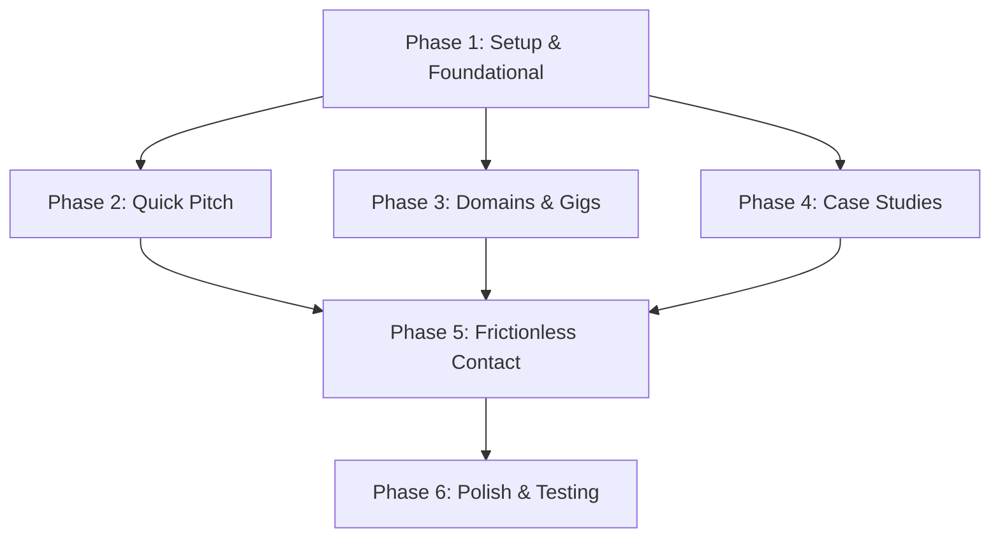

# Implementation Tasks: Sales Funnel & Gigs

**Feature**: Comprehensive Sales Transformation
**Spec**: [spec.md](./spec.md) | **Plan**: [plan.md](./plan.md)

## Implementation Strategy
We are migrating to Astro + React. The strategy is to initialize the Astro environment first (Setup), create foundational layouts and data structures, and then implement the specific user stories as modular Astro/React components.

## Phase 1: Setup & Foundational
*Goal*: Initialize Astro project, migrate assets, and create data models.
- [x] T001 Initialize Astro project with React integration in the root directory.
- [x] T002 Migrate existing global CSS variables and styling to `public/css/style.css` to maintain Quiet Luxury.
- [x] T003 Migrate existing images to `public/images/`.
- [x] T004 Create `src/layouts/Layout.astro` preserving the original Loader HTML and CSS.
- [x] T005 [P] Create `src/data/gigs.json` containing the Domain/Gig structure.
- [x] T006 [P] Create `src/data/projects.json` containing the project case study data.

## Phase 2: [US1] The 3-Second Quick Pitch
*Goal*: Create a high-impact intro section answering the core sales questions.
- [x] T007 [US1] Create `src/components/astro/Hero.astro` component.
- [x] T008 [US1] Update `src/components/astro/Hero.astro` to include the Quick Pitch messaging.
- [x] T009 [US1] Update `src/components/astro/Hero.astro` to feature a "Get a Quote / Contact Me" CTA.
- [x] T010 [US1] Integrate `<Hero />` into `src/pages/index.astro`.

## Phase 3: [US2] Domains & Gigs Discovery
*Goal*: Restructure services into domains and specific actionable gigs.
- [x] T011 [P] [US2] Research and expand `src/data/gigs.json` with 14 high-demand gigs across the 3 core domains (Data Analytics, Marketing, Tech/Web Solutions), covering both simple gigs and large projects.
- [x] T012 [P] [US2] Update `public/js/translations.js` with English and Egyptian Arabic translation keys (`gig_*_title`, `gig_*_desc`, `domain_*_title`, `domain_*_desc`) for all new domains and gigs.
- [x] T013 [P] [US2] Create `src/components/astro/GigCard.astro` with premium Quiet Luxury glassmorphism styling, bilingual `data-i18n` bindings, and interactive hover states.
- [x] T014 [US2] Create `src/components/astro/ServicesGrid.astro` to import `gigs.json` and render the domain categories and their respective `<GigCard />` grids.
- [x] T015 [US2] Integrate `<ServicesGrid />` into `src/pages/index.astro` and verify the legacy Education and Services sections are removed.

## Phase 4: [US3] Immersive Case Studies (Internal Projects)
*Goal*: Horizontal project slider with an internal case study viewer using React.
- [x] T016 [US3] Create `src/components/react/CaseStudyOverlay.tsx` with a Back button and overlay styling.
- [x] T017 [US3] Create `src/components/react/ProjectSlider.tsx` to read `projects.json`, render the horizontal slider, and manage the overlay open/close state.
- [x] T018 [US3] Integrate `<ProjectSlider client:load />` into `src/pages/index.astro`.
- [x] T019 [US3] Enable `<ViewTransitions />` in `src/layouts/Layout.astro` for SPA feel.

## Phase 5: [US4] Frictionless Contact
*Goal*: Sticky mobile contact bar.
- [x] T020 [US4] Create `src/components/astro/StickyCTA.astro` with WhatsApp and Phone buttons.
- [x] T021 [US4] Add CSS to `src/components/astro/StickyCTA.astro` to fix it to the bottom on viewports `< 768px`.
- [x] T022 [US4] Integrate `<StickyCTA />` into `src/layouts/Layout.astro`.

## Phase 6: Polish & Comprehensive Testing
*Goal*: Ensure 100% visual integrity, keep the Loader, and provide a documented test script.
- [x] T023 Verify the Preloader and Icons load perfectly without errors in `src/layouts/Layout.astro`.
- [x] T024 Create `specs/013-sales-funnel-gigs/test-plan.md` outlining the manual verification steps for Slider, Overlay, Mobile CTA, and Astro Islands hydration.
- [x] T025 Execute local testing via `npm run dev` to confirm 60fps animations and immediate interaction feedback.

## Dependencies

