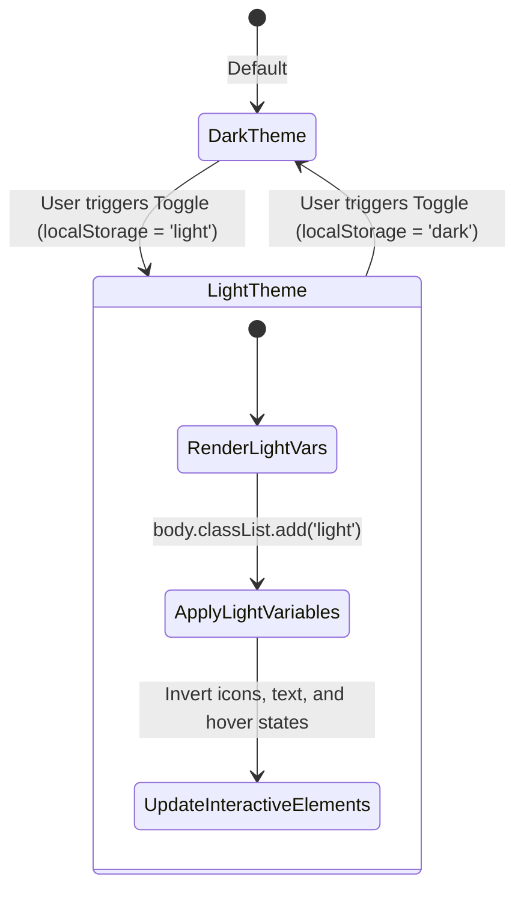

# Data Model: Light Theme Variables & State

While this feature is visual and does not introduce database tables or persistent server-side entities, it relies on structured CSS custom properties (variables) that represent our theme configuration.

## CSS Variables Schema

```yaml
ThemeVariables:
  --light-bg:
    description: Primary background color for the application viewport
    value: "#f3f4f7" (Light grayish-white)
  --light-surface:
    description: Secondary elevation background for container elements like cards and header
    value: "#ffffff" (Solid white)
  --light-text:
    description: High emphasis typography color
    value: "#071026" (Very dark blue-gray)
  --light-muted:
    description: Muted typography color for tags, dates, and labels
    value: "#4a5568" (Slate gray)
  --light-accent-a:
    description: Primary Brand Accent (Teal)
    value: "#006679"
  --light-accent-b:
    description: Secondary Brand Accent (Maroon)
    value: "#9b2e68"
  --border-subtle:
    description: Standard border lines separating card sub-sections
    light_value: "rgba(0, 0, 0, 0.12)"
  --border-faint:
    description: Low opacity outline decoration borders
    light_value: "rgba(0, 0, 0, 0.08)"
```

## State Model


